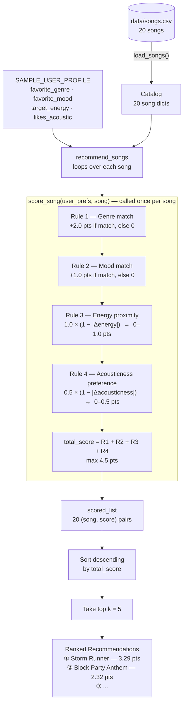
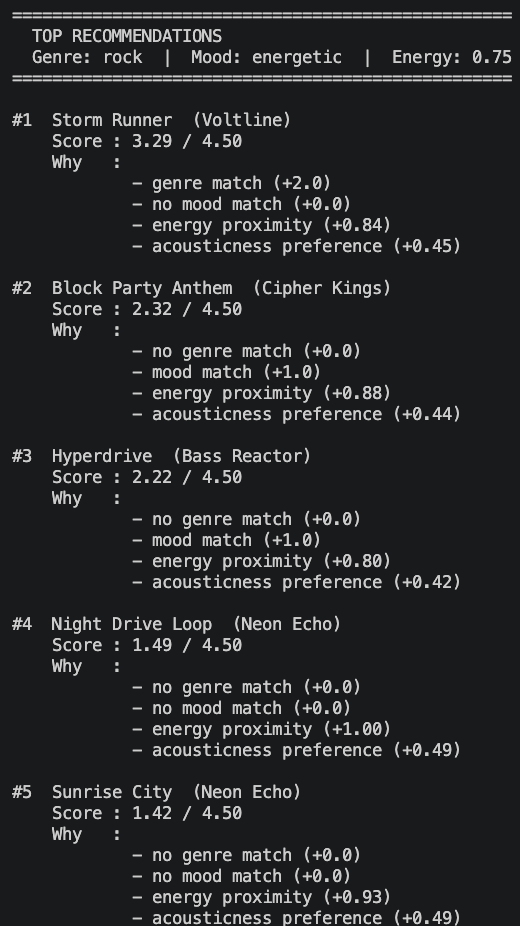
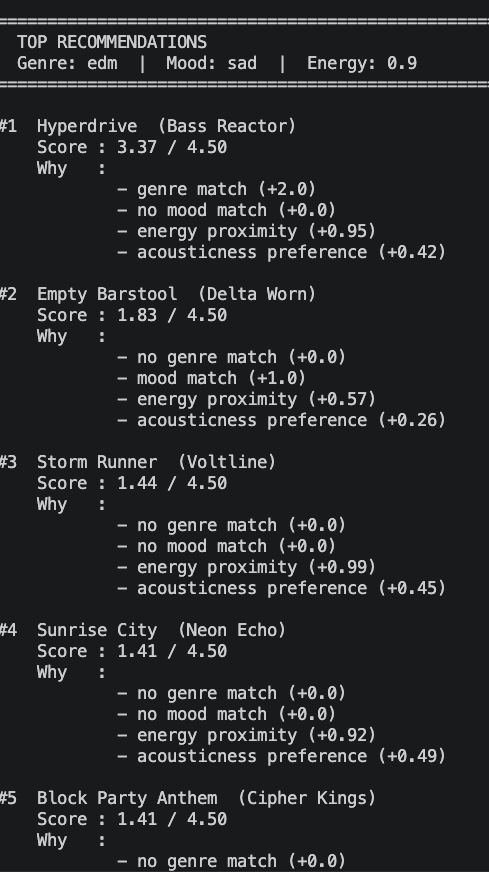
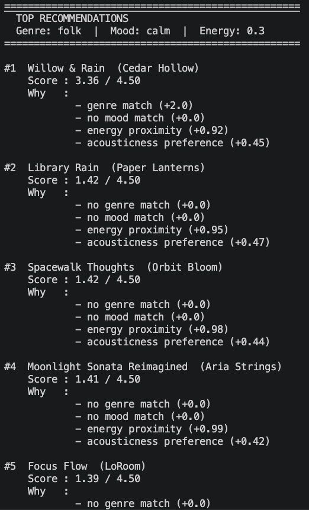
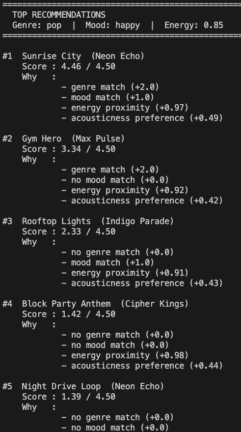
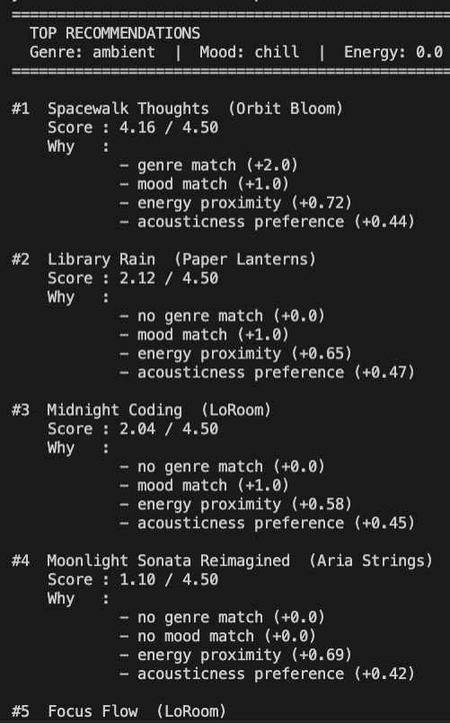

# 🎵 Music Recommender Simulation

## Project Summary

In this project you will build and explain a small music recommender system.

Your goal is to:

- Represent songs and a user "taste profile" as data
- Design a scoring rule that turns that data into recommendations
- Evaluate what your system gets right and wrong
- Reflect on how this mirrors real world AI recommenders

Replace this paragraph with your own summary of what your version does.

---

## How The System Works

### Real-World Context: Two Ways to Recommend

Most recommendation systems use one of two approaches. **Collaborative filtering** ignores the content of songs entirely — it looks at the listening behavior of thousands of other users and asks *"people who liked what you liked also liked this."* This is how Spotify's Discover Weekly works. 

**Content-based filtering** takes the opposite approach: it ignores other users entirely and matches songs to a listener based purely on the attributes of the songs themselves — genre, mood, energy, and so on. In this way, the system is fully explainable and requires no user history data.

---

### Song Features

Each `Song` object stores both descriptive labels and numerical audio attributes:

| Feature | Type | Example |
|---|---|---|
| `genre` | categorical | `"lofi"`, `"rock"`, `"jazz"` |
| `mood` | categorical | `"chill"`, `"intense"`, `"happy"` |
| `energy` | float [0–1] | `0.82` (high energy) |
| `acousticness` | float [0–1] | `0.86` (very acoustic) |
| `valence` | float [0–1] | `0.71` (positive/upbeat feel) |
| `danceability` | float [0–1] | `0.79` (highly danceable) |
| `tempo_bpm` | integer | `118` BPM |

---

### UserProfile Fields

A `UserProfile` captures a listener's taste as four preferences that map directly onto the song features above:

- `favorite_genre` — the genre the user most wants to hear
- `favorite_mood` — the listening mood they are in right now
- `target_energy` — a float [0–1] representing how energetic they want the music to be
- `likes_acoustic` — a boolean indicating whether they prefer acoustic or electronic sound

---

### How a Score Is Computed (per song)

The `Recommender` calls `score_song()` on every song in the catalog. Each song earns **raw points** across four rules, then songs are ranked by total score. The maximum possible score is **4.5 points**.

```
total_score = genre_points
            + mood_points
            + energy_points
            + acousticness_points
```

#### The Four Rules

| # | Component | Max pts | Type | Formula |
|---|---|---|---|---|
| 1 | Genre match | **2.0** | Binary | `2.0` if `song.genre == user.favorite_genre`, else `0` |
| 2 | Mood match | **1.0** | Binary | `1.0` if `song.mood == user.favorite_mood`, else `0` |
| 3 | Energy proximity | **1.0** | Continuous | `1.0 × (1 − \|song.energy − user.target_energy\|)` |
| 4 | Acousticness preference | **0.5** | Continuous | `0.5 × (1 − \|song.acousticness − acousticness_pref\|)` |

where `acousticness_pref = 0.8` if `user.likes_acoustic` is `True`, else `0.2`.

#### Why These Weights

**Genre gets 2.0 (44% of max).**  
The catalog has 14 distinct genres across 20 songs — most genres appear once. Genre is the sharpest filter a listener has, so it earns the largest single reward. A genre match alone (2.0 pts) beats any combination of mood + energy + acousticness (max 2.5 pts) only when those other signals are near-perfect, which keeps rankings competitive rather than locked.

**Mood gets 1.0 (22% of max).**  
Mood reflects listening *intent* right now, not long-term taste. Weighting it at exactly half of genre means: a wrong-genre song with the right mood and great energy can still out-rank a genre-match with badly mismatched energy. This prevents the system from acting like a pure genre filter.

**Energy gets 1.0 (22% of max).**  
Energy spans the widest range in the catalog: `0.28` (Spacewalk Thoughts) to `0.97` (Shattered Glass) — a spread of `0.69`. Giving it a full 1.0-point ceiling means the proximity score has real resolution: a perfect energy match earns `1.0`, a worst-case mismatch earns only `0.31`. This is enough to meaningfully separate songs within the same genre.

**Acousticness gets 0.5 (11% of max).**  
Texture preference (electric vs. acoustic) is a real signal but should not override genre, mood, or energy. At half-weight it acts as a tiebreaker: two otherwise equal songs will be separated by whether they match the user's acoustic taste.

#### Balance Check

| Signal | Max pts | Share |
|---|---|---|
| Categorical (genre + mood) | 3.0 | 67% |
| Numerical (energy + acousticness) | 1.5 | 33% |
| **Total** | **4.5** | **100%** |

Categorical signals dominate (two-thirds of possible points) because they represent explicit listener preferences. Numerical signals are strong enough to sort songs within the same genre/mood tier but cannot override a categorical match on their own.

---

### Sample Taste Profile

The recommender uses a `user_prefs` dictionary (or `UserProfile` object) as input. Below is the concrete profile used in this simulation:

```python
SAMPLE_USER_PROFILE = {
    "favorite_genre": "rock",
    "favorite_mood": "energetic",
    "target_energy": 0.75,
    "likes_acoustic": False
}
```

**Why each value was chosen:**

| Field | Value | Rationale |
|---|---|---|
| `favorite_genre` | `"rock"` | Sets a clear genre anchor — songs that match earn the full 2.0-point bonus |
| `favorite_mood` | `"energetic"` | Paired with genre to reward driven, active songs rather than relaxed ones |
| `target_energy` | `0.75` | Moderately high — close to rock's range (0.85–0.97) but not so extreme that only one song qualifies |
| `likes_acoustic` | `False` | Prefers electric/produced sound; sets `acousticness_pref = 0.2` |

**Why this profile is not too narrow:**

`target_energy = 0.75` sits between the catalog extremes (0.28–0.97). Songs in the 0.60–0.90 band all earn 0.85+ energy points, keeping several songs competitive. A perfectly narrow target like `0.97` would shrink the energy term to a single near-winner and flatten the rest of the ranking.

**Worked example — differentiating "intense rock" from "chill lofi":**

`acousticness_pref = 0.2` (because `likes_acoustic = False`)

| Song | genre pts | mood pts | energy pts | acoustic pts | **Total / 4.5** |
|---|---|---|---|---|---|
| Storm Runner (rock, intense, e=0.91, a=0.10) | **2.0** | 0.0 | 1.0×(1−0.16)=**0.84** | 0.5×(1−0.10)=**0.45** | **3.29** |
| Block Party Anthem (hip-hop, energetic, e=0.87, a=0.08) | 0.0 | **1.0** | 1.0×(1−0.12)=**0.88** | 0.5×(1−0.12)=**0.44** | **2.32** |
| Shattered Glass (metal, angry, e=0.97, a=0.06) | 0.0 | 0.0 | 1.0×(1−0.22)=**0.78** | 0.5×(1−0.14)=**0.43** | **1.21** |
| Midnight Coding (lofi, chill, e=0.42, a=0.71) | 0.0 | 0.0 | 1.0×(1−0.33)=**0.67** | 0.5×(1−0.51)=**0.25** | **0.92** |
| Library Rain (lofi, chill, e=0.35, a=0.86) | 0.0 | 0.0 | 1.0×(1−0.40)=**0.60** | 0.5×(1−0.66)=**0.17** | **0.77** |

**What the numbers show:**
- Storm Runner (3.29) leads because genre is the dominant rule — 2.0 points is an insurmountable head start against no-genre-match songs.
- Block Party Anthem (2.32) finishes second: no genre match, but the mood bonus (1.0) plus near-perfect energy (0.88) outweighs Shattered Glass which has neither.
- Shattered Glass (1.21) earns only proximity points — high energy helps, but without genre or mood it stays in the middle tier.
- The two lofi songs (0.92, 0.77) land at the bottom: wrong genre, wrong mood, far energy, and wrong acousticness all compound.

---

### How Songs Are Chosen (ranking)

After scoring every song, `recommend_songs()` sorts the full scored list in descending order and returns the top `k` results (default `k = 5`). The pipeline looks like this:

```
Catalog (20 songs)
      │
      ▼  score_song() × 20
[(song, 0.91), (song, 0.74), (song, 0.43), ...]
      │
      ▼  sort descending, take top k
[song_5, song_10, song_2, ...]   ← recommendations
```

---

### Data Flow Diagram

| Stage | What happens |
|---|---|
| **Input** | `data/songs.csv` is loaded into a list of 20 song dicts. `SAMPLE_USER_PROFILE` supplies the four listener preferences. Both are passed to `recommend_songs()`. |
| **Process — The Loop** | `recommend_songs()` iterates over every song and calls `score_song(user_prefs, song)` once per song. Each call applies the four rules in order (genre → mood → energy → acousticness) and sums them to a `total_score` (max 4.5 pts). The `(song, score)` pair is appended to `scored_list`. |
| **Output — The Ranking** | After all 20 songs are scored, `scored_list` is sorted in descending order by `total_score`. The top `k = 5` entries are returned as the final recommendations. |



---

### Expected Biases (Before Implementation)

- This system may over-prioritize genre because it carries 44% of the total score — a no-genre-match song starts 2.0 points behind before any other rule runs.
- Mood matching is binary because the rule uses an exact string comparison (`==`), so "energetic" and "intense" are treated as completely different even though they are acoustically similar.
- `likes_acoustic` is a boolean, so the formula hard-maps user preference to either `0.8` or `0.2` — listeners whose real taste sits anywhere in between will always be misrepresented.

---

## Getting Started

### Setup

1. Create a virtual environment (optional but recommended):

   ```bash
   python -m venv .venv
   source .venv/bin/activate      # Mac or Linux
   .venv\Scripts\activate         # Windows

2. Install dependencies

```bash
pip install -r requirements.txt
```

3. Run the app:

```bash
python -m src.main
```

### Running Tests

Run the starter tests with:

```bash
pytest
```

You can add more tests in `tests/test_recommender.py`.

---

## Experiments You Tried

- What happened when you changed the weight on genre from 2.0 to 0.5
- What happened when you added tempo or valence to the score
- How did your system behave for different types of users

---

### Exp 1: Phase 3 CLI Verification

The starter example profile (`"pop"` / `"happy"`) was replaced with a custom profile (`"rock"` / `"energetic"`, `target_energy = 0.75`, `likes_acoustic = False`) to test how the scoring rules behave for a higher-energy listener.



---

### Exp 2: Phase 4 Stress Test — Diverse and Edge-Case Profiles

Four additional user profiles were run to probe where the scoring logic breaks down. Each profile was designed to trigger a specific weakness in the four-rule formula.

---

#### Profile A — Genre/Mood Split (`edm / sad / energy: 0.9`)

No song in the catalog is both EDM and sad. This forces a direct conflict between Rule 1 (genre, +2.0 max) and Rule 2 (mood, +1.0 max).



**Result:** *Hyperdrive* (EDM, energetic) scored **3.37** while *Empty Barstool* (blues, sad) scored only **1.83**. The system recommended loud dance music to a user who explicitly asked for sad songs. Genre's 2:1 weight over mood is enough to completely override mood intent when the two signals point to different songs.

---

#### Profile B — Mood Value Not in Dataset (`folk / calm / energy: 0.3`)

The mood `"calm"` does not appear in any song's `mood` field (the closest values are `"chill"`, `"relaxed"`, and `"peaceful"`). Rule 2 scores zero for every candidate.



**Result:** *Willow & Rain* (folk, peaceful) ranked #1 at **3.38** — entirely on genre and energy proximity. The mood preference was silently dropped. The output shows `no mood match (+0.0)` for every song, but nothing alerts the user that their mood preference was unrecognized.

---

#### Profile C — Near-Perfect Match (`pop / happy / energy: 0.85`)

This profile was designed as a positive control: a user whose preferences align closely with a real song in the catalog (*Sunrise City*: pop, happy, energy 0.82).



**Result:** *Sunrise City* scored **4.46 / 4.50** — the highest score observed across all runs. All four rules fired and contributed. This confirms the scoring formula can produce near-maximum results when preferences align, and provides a useful baseline for comparing the edge cases above.

---

#### Profile D — Unreachable Energy Target (`ambient / chill / energy: 0.0`)

The lowest-energy song in the catalog is *Spacewalk Thoughts* at `0.28`. A target of `0.0` means no song can earn the full `+1.0` energy points — every candidate is penalized before scoring begins.



**Result:** *Spacewalk Thoughts* (the only ambient/chill song) scored **4.16** instead of the theoretical **4.50**. The energy ceiling was 0.72 rather than 1.0. The system still ranked the correct song first, but the score underrepresents how good the match actually is — a user or developer reading the score without context might think the recommendation is weaker than it is.

---

## Limitations and Risks

Summarize some limitations of your recommender.

Examples:

- It only works on a tiny catalog
- It does not understand lyrics or language
- It might over favor one genre or mood

You will go deeper on this in your model card.

---

## Reflection

Read and complete `model_card.md`:

[**Model Card**](model_card.md)

Write 1 to 2 paragraphs here about what you learned:

- about how recommenders turn data into predictions
- about where bias or unfairness could show up in systems like this


---

## 7. `model_card_template.md`

Combines reflection and model card framing from the Module 3 guidance. :contentReference[oaicite:2]{index=2}  

```markdown
# 🎧 Model Card - Music Recommender Simulation

## 1. Model Name

Give your recommender a name, for example:

> VibeFinder 1.0

---

## 2. Intended Use

- What is this system trying to do
- Who is it for

Example:

> This model suggests 3 to 5 songs from a small catalog based on a user's preferred genre, mood, and energy level. It is for classroom exploration only, not for real users.

---

## 3. How It Works (Short Explanation)

Describe your scoring logic in plain language.

- What features of each song does it consider
- What information about the user does it use
- How does it turn those into a number

Try to avoid code in this section, treat it like an explanation to a non programmer.

---

## 4. Data

Describe your dataset.

- How many songs are in `data/songs.csv`
- Did you add or remove any songs
- What kinds of genres or moods are represented
- Whose taste does this data mostly reflect

---

## 5. Strengths

Where does your recommender work well

You can think about:
- Situations where the top results "felt right"
- Particular user profiles it served well
- Simplicity or transparency benefits

---

## 6. Limitations and Bias

Where does your recommender struggle

Some prompts:
- Does it ignore some genres or moods
- Does it treat all users as if they have the same taste shape
- Is it biased toward high energy or one genre by default
- How could this be unfair if used in a real product

---

## 7. Evaluation

How did you check your system

Examples:
- You tried multiple user profiles and wrote down whether the results matched your expectations
- You compared your simulation to what a real app like Spotify or YouTube tends to recommend
- You wrote tests for your scoring logic

You do not need a numeric metric, but if you used one, explain what it measures.

---

## 8. Future Work

If you had more time, how would you improve this recommender

Examples:

- Add support for multiple users and "group vibe" recommendations
- Balance diversity of songs instead of always picking the closest match
- Use more features, like tempo ranges or lyric themes

---

## 9. Personal Reflection

A few sentences about what you learned:

- What surprised you about how your system behaved
- How did building this change how you think about real music recommenders
- Where do you think human judgment still matters, even if the model seems "smart"

